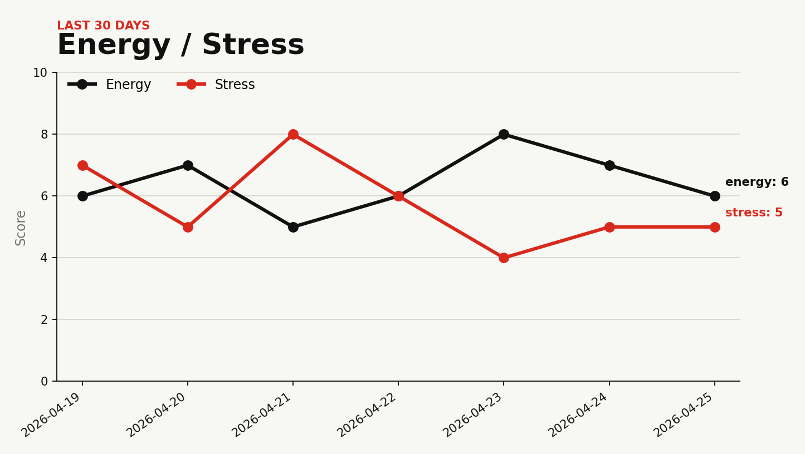
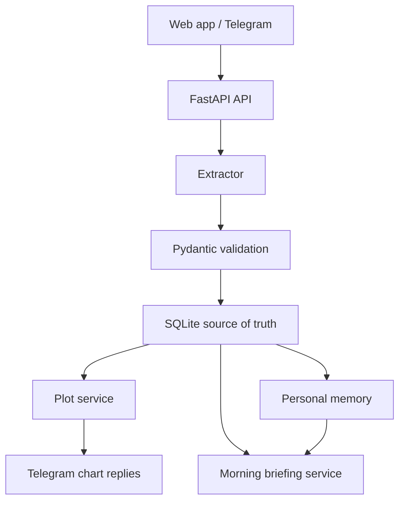

# Life OS

A local-first life logging assistant with a minimalist interface, structured memory, Telegram input, and Swiss-inspired analytics.

Life OS is built around one idea: your agent should not be the database. The app keeps your raw notes, extracts structured records, stores them locally, and uses those records for plots, summaries, and future daily briefings.



## What It Does

Send a messy note from the web app or Telegram:

```text
Today I slept 6h, woke up tired, energy 5/10 and stress 7/10.
Ate oatmeal with dates and peanut butter.
Did lower body: squats 4x5 at 80%, RDL 3x8, and 12 min metcon.
Worked 3 hours on the global TAGI-LSTM paper and fixed the SKF motivation section.
```

Life OS stores the original text, extracts structured rows, asks useful follow-up questions when details are missing, and keeps everything queryable:

```text
raw message -> validated extraction -> SQLite rows -> plots, search, briefings
```

Ask for plots directly in Telegram:

```text
plot my energy
show my career hours
plot my workouts
plot protein for the last week
```

If you send those four lines together, Life OS returns four separate chart images.

## Current Features

- Local SQLite source of truth
- Raw message archive for every logged note
- Structured logs for wellbeing, nutrition, workouts, exercises, career, and journal entries
- Context-aware logging that fills missing workout details from recent matching exercises
- Same-day structured duplicate prevention
- Controlled log deletion from the web app or Telegram
- Long-term memory for explicit preferences, strategies, goals, and briefing style
- OpenRouter-backed LLM extraction with deterministic fallback
- Telegram webhook with user allowlist and webhook secret support
- Plot generation through safe, predefined query mappings
- Multi-line Telegram plot batches
- Morning briefings from deterministic trend features with optional LLM wording
- Minimal local web surface served by FastAPI
- Privacy-focused defaults: ignored `.env`, ignored local data, no arbitrary SQL from the agent

## Architecture



The database is the product core. Agents, chat channels, and dashboards sit on top of it.

## Quick Start

```bash
python -m venv .venv
source .venv/bin/activate
pip install -e ".[dev]"
python -m uvicorn backend.app.main:app --reload
```

Then open:

```text
http://127.0.0.1:8000
```

Run tests:

```bash
python -m unittest discover -s tests
```

## Deploy

For a free cloud deployment with automatic deploys from `main`, use Render for the FastAPI service and Turso for persistent SQLite-compatible storage. See [Deployment](docs/DEPLOYMENT.md).

## Configuration

Create a local `.env` file. It is ignored by git.

```text
LIFE_OS_EXTRACTOR=auto
LIFE_OS_TIMEZONE=America/Toronto
LIFE_OS_WEB_USERNAME=life-os
LIFE_OS_WEB_PASSWORD=
LIFE_OS_REQUIRE_WEB_AUTH=false

OPENROUTER_API_KEY=
OPENROUTER_MODEL=nvidia/nemotron-3-super-120b-a12b:free
OPENROUTER_FALLBACK_MODELS=nvidia/nemotron-3-nano-30b-a3b:free
LIFE_OS_LLM_TIMEOUT_SECONDS=60

TELEGRAM_BOT_TOKEN=
TELEGRAM_ALLOWED_USER_IDS=
TELEGRAM_WEBHOOK_SECRET=
TELEGRAM_BRIEFING_CHAT_ID=
TELEGRAM_SEND_CONFIRMATIONS=true
BRIEFING_CRON_SECRET=

TURSO_DATABASE_URL=
TURSO_AUTH_TOKEN=
```

Set `LIFE_OS_WEB_PASSWORD` in production. On Render, web auth is required by default; if the password is missing, the dashboard and normal API routes fail closed instead of becoming public. `/health` stays open for Render health checks, and `/api/telegram/webhook` stays open to Telegram but remains protected by `TELEGRAM_WEBHOOK_SECRET`.

For local Telegram testing with ngrok:

```bash
python -m uvicorn backend.app.main:app --host 127.0.0.1 --port 8000
python scripts/start_ngrok.py
python scripts/set_telegram_webhook.py https://your-ngrok-url.example
```

Ask Telegram for a briefing:

```text
morning brief
/brief
```

Teach the assistant durable preferences:

```text
remember that briefings should be direct and concise
remember that training early works for me
remember that I don't like vague motivational advice
```

Delete mistakes without touching the database directly:

```text
delete logs
delete meal #12
delete last workout
delete today's journal
```

## Data Model

Every inbound message becomes one raw record plus zero or more structured records:

```text
raw_messages
daily_checkins
nutrition_logs
workout_logs
workout_exercises
career_logs
journal_entries
memory_items
```

Structured rows point back to `source_message_id`, so every chart and future briefing can be traced to the original note. Memory items keep evidence and confidence so personal context can be corrected later.

## Documentation

- [Examples](docs/EXAMPLES.md)
- [Deployment](docs/DEPLOYMENT.md)
- [Roadmap](ROADMAP.md)
- [Contributing](CONTRIBUTING.md)
- [Security](SECURITY.md)

## Project Direction

The MVP is now centered on logging, extraction, Telegram, plots, morning briefings, and personal memory. Next phases focus on stronger search, correction workflows, and optional gateway integrations.
